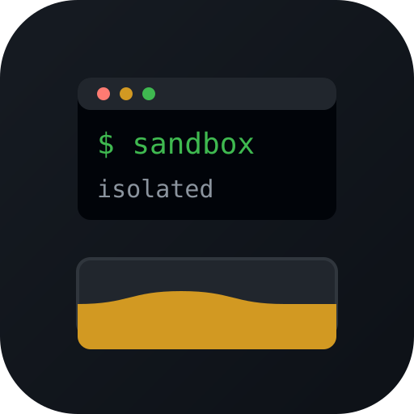

# OpenCode Sandbox

[](https://github.com/Antiquete/opencode-sandbox/actions/workflows/ci.yml)

<p align="center">
  
</p>

Worried about letting an agentic AI run rampant on your system, wreak havoc,
or steal your files? Worry not! The opencode-sandbox is here!

Let any agentic AI run wild, do anything, install packages, mess with the system, anything, everything. Whatever it does stays inside the sandbox.

All containers share config. No need to redo preferences, agents, skills, mcps, anything!

Session remains preserved, start where you left off. Only the container resets, not opencode data.

## Requirements

- **docker** or **podman** CLI with a running daemon
- **gVisor** (optional) — only needed for `--gvisor`; install `runsc` and register it as a Docker runtime

## Installing

### AUR (Arch)

```sh
yay -S opencode-sandbox-git
```

### Direct install

```sh
# Debian / Ubuntu
sudo apt install ./opencode-sandbox_*_all.deb
# Fedora
sudo dnf install ./opencode-sandbox-*.noarch.rpm
# Arch
sudo pacman -U ./opencode-sandbox-*-any.pkg.tar.zst
# Gentoo
sudo emerge opencode-sandbox
```

### Manual

```sh
tar -xzf opencode-sandbox-*.tar.gz
cp opencode-sandbox-*/{opencode-sandbox,opencode-project-init} ~/.local/bin
```

## Usage

`opencode-project-init` - set up a project for sandboxing.
`opencode-sandbox` - start an isolated OpenCode session in the current project.

```sh
cd ~/code/myproject
opencode-project-init   # one time, creates the sandbox folder
opencode-sandbox        # opens the sandbox
opencode-sandbox --model some-model run "fix the typos in src/"
opencode-sandbox --continue
```

- The `.opencode-sandbox/` folder in your project holds the sandbox session data.
- Everything after the script name is passed through to OpenCode.

## Options

| Flag                      | Description                                                                                                                                                                                                                                                                                                                        |
| ------------------------- | ---------------------------------------------------------------------------------------------------------------------------------------------------------------------------------------------------------------------------------------------------------------------------------------------------------------------------------- |
| `--offline`               | Skip the image pull (`--pull never`); use whatever image is already present. Useful on offline/unreliable networks.                                                                                                                                                                                                                 |
| `--runtime <name>`        | Force a container runtime: `docker`, `podman`, or `auto` (default). `auto` uses whichever is installed and running.                                                                                                                                                                                                                 |
| `--gvisor`                | Run under gVisor's `runsc` sandboxing runtime instead of the default `runc` (Docker only; requires the `runsc` runtime registered in `/etc/docker/daemon.json`). `runsc` runs the container in a userspace kernel, so host `/proc` and `/sys` surfaces are emulated, not exposed.                                                     |
| `--docker-network <name>` | Attach the container to a named network (created automatically if it doesn't exist; requires permission to create networks). Defaults to the runtime's default network. Useful for reaching a provider on another container (e.g. a local LLM server on `local-ai-net`), or `host` to reach services bound to the host's `localhost`. |
| anything else             | Forwarded to OpenCode, e.g. `--model`, `--continue`, `run`, `--help`.                                                                                                                                                                                                                                                              |

Example with a custom network:

```sh
# same network as a local Ollama/LM Studio container
opencode-sandbox --docker-network local-ai-net
```

Custom image:

```sh
# pin a version or use a mirror registry
OPENCODE_IMAGE=ghcr.io/anomalyco/opencode:0.9.4 opencode-sandbox
```

## Security Model

The container is launched with:

- All Linux capabilities dropped (`--cap-drop ALL`)
- Privilege escalation blocked (`--security-opt no-new-privileges`)
- Interactive read/write access to the current project only
- State persisted under `<project>/.opencode-sandbox`, reachable inside the container
  only at its data path (`/root/.local/share/opencode`); it is masked out of the
  project tree so the agent can't poke at it as project content
- Shared config at `~/.config/opencode` (read/write)

Both runtimes mask the four host `/sys` surfaces on tmpfs. Podman additionally
masks `/proc/cmdline`, `/proc/cpuinfo`, and `/proc/meminfo`
(`--security-opt mask=…`) — paths Docker cannot mask.

With `--gvisor`, the container runs under gVisor's `runsc`, a userspace kernel,
so the host `/proc` and `/sys` surfaces are emulated instead of exposed — even
paths Docker cannot mask. Requires the `runsc` runtime registered with Docker.

## Security Matrix — Containerizer Comparison

<table>
  <thead>
    <tr><th align="left">Surfaces</th><th align="center">Docker</th><th align="center">Podman</th><th align="center">Docker + gVisor</th><th align="left">Info</th></tr>
  </thead>
  <tbody>
    <tr>
      <td><code>*</code></td>
      <td align="center">Total separation ✔</td>
      <td align="center">Total separation ✔</td>
      <td align="center">Total separation ✔</td>
      <td>Container can't access host system except for some read-only surfaces, depending on the containerizer used</td>
    </tr>
    <tr>
      <td colspan="5" align="center"><strong>Additional Hardening</strong></td>
    </tr>
    <tr>
      <td><code>/sys/class/dmi/id</code></td>
      <td align="center">Blocked (tmpfs) ✔</td>
      <td align="center">Blocked (tmpfs) ✔</td>
      <td align="center">Emulated ✔</td>
      <td>Motherboard info (serial, UUID, vendor)</td>
    </tr>
    <tr>
      <td><code>/sys/block</code></td>
      <td align="center">Blocked (tmpfs) ✔</td>
      <td align="center">Blocked (tmpfs) ✔</td>
      <td align="center">Emulated ✔</td>
      <td>Disk model, size, type</td>
    </tr>
    <tr>
      <td><code>/sys/devices/virtual/block</code></td>
      <td align="center">Blocked (tmpfs) ✔</td>
      <td align="center">Blocked (tmpfs) ✔</td>
      <td align="center">Emulated ✔</td>
      <td>Encrypted disk setup (dm names, LUKS, backing devices)</td>
    </tr>
    <tr>
      <td><code>/sys/bus/pci</code></td>
      <td align="center">Blocked (tmpfs) ✔</td>
      <td align="center">Blocked (tmpfs) ✔</td>
      <td align="center">Emulated ✔</td>
      <td>GPUs and other PCI hardware (vendor/model, driver)</td>
    </tr>
    <tr>
      <td><code>/proc/cmdline</code></td>
      <td align="center">Docker limitation ✘</td>
      <td align="center">Blocked (masked path) ✔</td>
      <td align="center">Emulated ✔</td>
      <td>Kernel boot options (root disk, LUKS UUIDs, security)</td>
    </tr>
    <tr>
      <td><code>/proc/cpuinfo</code></td>
      <td align="center">Docker limitation ✘</td>
      <td align="center">Blocked (masked path) ✔</td>
      <td align="center">Emulated ✔</td>
      <td>CPU model and core count</td>
    </tr>
    <tr>
      <td><code>/proc/meminfo</code></td>
      <td align="center">Docker limitation ✘</td>
      <td align="center">Blocked (masked path) ✔</td>
      <td align="center">Emulated ✔</td>
      <td>Host memory (total, swap)</td>
    </tr>
    <tr>
      <td><code>/proc/self/mountinfo</code></td>
      <td align="center">Docker limitation ✘</td>
      <td align="center">Podman limitation ✘</td>
      <td align="center">Emulated ✔</td>
      <td>The container's own mounts and their host mapping</td>
    </tr>
  </tbody>
</table>

**Legend:** `✔` implemented · `⧗` planned · `✘` Docker/Podman limitation

## License

GPL-3.0-or-later — see [LICENSE](LICENSE).
