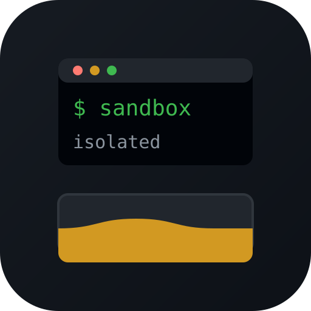

# OpenCode Sandbox

[](https://github.com/Antiquete/opencode-sandbox/actions/workflows/ci.yml)

<p align="center">
  
</p>

Worried about letting an agentic AI run rampant on your system, wreak havoc,
or steal your files? Worry not! The opencode-sandbox is here!

Let any agentic AI run wild, do anything, install packages, mess with the system, anything, everything. Whatever it does stays inside the sandbox.

All containers share config. No need to redo preferences, agents, skills, mcps, anything!

Session remains preserved, start where you left off. Only the container resets, not opencode data.

## Requirements

- **bash** and a **docker** or **podman** CLI with a running daemon
- **gVisor** (optional) — only needed for `--gvisor`; install `runsc` and register it as a Docker runtime
- **cc and make** (optional) — only to build the seccomp guard from source or run `make test` (with `python3`); packages ship a prebuilt guard

## Installing

### AUR (Arch)

```sh
yay -S opencode-sandbox-git   # built from git, guard compiled on install
yay -S opencode-sandbox-bin   # release tarball with the prebuilt guard
```

### Direct install

```sh
# Debian / Ubuntu
sudo apt install ./opencode-sandbox_*_all.deb
# Fedora
sudo dnf install ./opencode-sandbox-*.noarch.rpm
# Arch
sudo pacman -U ./opencode-sandbox-*-any.pkg.tar.zst
# Gentoo
sudo emerge opencode-sandbox
```

### Manual

```sh
tar -xzf opencode-sandbox-*.tar.gz
cd opencode-sandbox-*/
mkdir -p ~/.local/bin/build
cp opencode-sandbox opencode-project-init ~/.local/bin/
cp build/opencode-guard ~/.local/bin/build/
```

The launcher expects the guard at `build/opencode-guard` next to itself, or at
the packaged location `/usr/lib/opencode-sandbox/guard`; `OPENCODE_GUARD`
points at any other trusted binary. To rebuild the guard, run `make` (needs
`cc`).

## Usage

`opencode-project-init` - set up a project for sandboxing.
`opencode-sandbox` - start an isolated OpenCode session in the current project.

```sh
cd ~/code/myproject
opencode-project-init   # one time, creates the sandbox folder
opencode-sandbox        # opens the sandbox
opencode-sandbox --model some-model run "fix the typos in src/"
opencode-sandbox --continue
```

- The `.opencode-sandbox/` folder in your project holds the sandbox session data.
- Everything after the script name is passed through to OpenCode. Use `--` to
  forward even arguments that look like sandbox flags.

## Options

| Flag                      | Description                                                                                                                                                                                                                                                                                                                        |
| ------------------------- | ---------------------------------------------------------------------------------------------------------------------------------------------------------------------------------------------------------------------------------------------------------------------------------------------------------------------------------- |
| `--offline`               | Skip the image pull (`--pull never`); use whatever image is already present. Useful on offline/unreliable networks.                                                                                                                                                                                                                 |
| `--no-network`            | Run with no network: the container gets `--network none`, with no bridge and no external connectivity. Pair with `--offline` for a fully offline local session. The network is not auto-created.                                                                                                                                     |
| `--runtime <name>`        | Force a container runtime: `docker`, `podman`, or `auto` (default). `auto` uses whichever is installed and running.                                                                                                                                                                                                                 |
| `--gvisor`                | Run under gVisor's `runsc` sandboxing runtime instead of the default `runc` (Docker only; requires the `runsc` runtime registered in `/etc/docker/daemon.json`). `runsc` runs the container in a userspace kernel, so host `/proc` and `/sys` surfaces are emulated, not exposed. The seccomp guard is skipped — runsc is the boundary. |
| `--docker-network <name>` | Attach the container to a named network (created automatically if it doesn't exist; requires permission to create networks). Defaults to the runtime's default network. Useful for reaching a provider on another container (e.g. a local LLM server on `local-ai-net`), or `host` to reach services bound to the host's `localhost`. |
| `--config-rw`            | Mount the shared config `~/.config/opencode` read-write instead of read-only. Needed to sign in or edit config from inside the sandbox. The host config changes persist. |
| anything else             | Forwarded to OpenCode, e.g. `--model`, `--continue`, `run`, `--help`.                                                                                                                                                                                                                                                              |

Example with a custom network:

```sh
# same network as a local Ollama/LM Studio container
opencode-sandbox --docker-network local-ai-net
```

Custom image:

```sh
# pin a version or use a mirror registry
OPENCODE_IMAGE=ghcr.io/anomalyco/opencode:0.9.4 opencode-sandbox
```

Other environment overrides: `OPENCODE_RUNTIME` (`docker`, `podman`, or `auto`),
`OPENCODE_GVISOR` (`0` or `1`), `OPENCODE_GUARD` (trusted guard binary path),
`OPENCODE_GUARD_DIR` (packaged guard directory, default
`/usr/lib/opencode-sandbox`), `OPENCODE_CONFIG_DIR`, `OPENCODE_MEMORY`,
`OPENCODE_CPUS`, `OPENCODE_PIDS`, and `OPENCODE_DNS`.

## Security Model

The container is launched with:

- All Linux capabilities dropped (`--cap-drop ALL`)
- Privilege escalation blocked (`--security-opt no-new-privileges`)
- Interactive read/write access to the current project only
- State persisted under `<project>/.opencode-sandbox`, reachable inside the container
  only at its data path (`/root/.local/share/opencode`); it is masked out of the
  project tree so the agent can't poke at it as project content
- Shared config at `~/.config/opencode` (read-only by default; opt into
  read/write with `--config-rw`)

A seccomp guard (a small static binary) runs as the container entrypoint.
Every `open`, `openat`, `openat2`, and `creat` the agent attempts is
intercepted; the guard performs the open itself, verifies what was actually
opened, and hands the checked descriptor over via a kernel notification.
Opens that resolve to procfs, sysfs, or cgroup filesystems are denied,
including symlink and magic-link aliases. `uname` and `sysinfo` report
sandbox numbers instead of the host's: a fixed hostname, a synthetic kernel
version, sandbox uptime, and the configured memory limit. The guard also
denies the syscalls that could escape the container: ptrace, process-memory
access, file-handle opens, mount and namespace changes, io_uring, BPF, and
installing replacement seccomp filters. This closes the Docker `/proc` gaps
that path-based masking cannot. Metadata-only syscalls such as `stat` and
`readlink` are not mediated; denying them globally breaks OpenCode's startup.
With `--gvisor`, the guard is skipped because the userspace kernel provides
its own boundary.

Under a rootful daemon the container runs as the host user (its UID/GID are
mapped with `--user`, and `/root` is masked with a writable tmpfs), so session
files written into the state store stay owned by you and need no `sudo` to
clean up. With a rootless daemon the unprivileged UID is already mapped, so no
extra wrapping is done.

The container starts with sane resource limits: 4 GB RAM, 2 CPUs, and
1024 processes. To override, set `OPENCODE_MEMORY`, `OPENCODE_CPUS`, or
`OPENCODE_PIDS` (e.g. `OPENCODE_MEMORY=8g opencode-sandbox`).

Network internals are hardened with conservative defaults in the container's
own network namespace (unless `--docker-network host` is used). The
network-tuning sysctls are skipped whenever the container shares the host's
network stack — whether via the user's own `--docker-network host` flag or any
host-driver bridge the user supplied. `--no-network` disables networking
entirely (`--network none`), for fully offline sessions.

The agent is also pinned to the CPUs its quota implies, so tools that report
core counts (`nproc`, `/proc/cpuinfo`, `Cpus_allowed`) show the sandbox size
instead of your host's hardware. Project and config are mounted non-recursively
with private propagation, so nested mounts on your host don't leak in.

The container uses a fixed hostname (`opencode`) and fresh resolver/hosts files
instead of the host's, so nothing identifies your machine. DNS defaults to
`1.1.1.1`; override with `OPENCODE_DNS` (e.g. `OPENCODE_DNS=9.9.9.9
opencode-sandbox`). It also gets its own private IPC and cgroup namespaces, and
core dumps are disabled (`--ulimit core=0`).

Before launching, the shared directories are checked for Unix sockets, device
nodes, FIFOs, and hard-linked files (they would expose host IPC or host files
through the mounts); the sandbox refuses to start if any are found. The config
and project directories must not overlap, and paths containing commas, quotes,
or newlines are rejected (they would break the container mounts). To share a
config location other than `~/.config/opencode`, set `OPENCODE_CONFIG_DIR`.

Sandbox options are validated before anything runs: `OPENCODE_GVISOR` must be
`0` or `1`, the image must be a real reference (anything starting with `-` is
rejected as a runtime option), and network names must be plain identifiers —
never namespaces, mounting modes, or inline options. `host` and `none` remain
selectable; which network the agent can see is the user's grant.

The launcher must be installed outside the sandboxed project directory, so the
agent can't replace the trusted launcher from inside. The `.opencode-sandbox`
state directory must be a real directory — the launcher refuses a symlinked
store, so the project's session data can't be silently redirected elsewhere.

Both scripts run with a restrictive `umask 077`, so everything they create — the
fresh resolver/hosts stubs and the private `.opencode-sandbox` store — is never
world-readable or world-writable.

`opencode-project-init` only ever creates the state store itself (never a
symlink and never an existing non-directory), and a fresh store is `chmod 0700`
so only the project owner can read the sandbox session data.

The `.gitignore` update is atomic: it writes a temp file in the project and
replaces the target in one step, preserving the file's existing permissions,
and it refuses symlinked or non-regular `.gitignore` files.

Both runtimes mask the host `/sys` fingerprint surfaces on read-only tmpfs
(`/sys/devices`, `/sys/module`, `/sys/bus/pci|usb|scsi`, `/sys/block`,
`/sys/class/dmi/id`, `/sys/kernel`, `/sys/power`, `/sys/fs/pstore`).
Podman additionally masks `/proc/cmdline`, `/proc/cpuinfo`, and `/proc/meminfo`
(`--security-opt mask=…`) — paths Docker cannot mask.

With `--gvisor`, the container runs under gVisor's `runsc`, a userspace kernel,
so the host `/proc` and `/sys` surfaces are emulated instead of exposed — even
paths Docker cannot mask. Requires the `runsc` runtime registered with Docker;
the check matches the registered runtime name exactly (never a context that
contains a look-alike name), because a container running under the wrong
runtime would violate the sandbox contract.

## Security Matrix — Containerizer Comparison

<table>
  <thead>
    <tr><th align="left">Surfaces</th><th align="center">Docker</th><th align="center">Podman</th><th align="center">Docker + gVisor</th><th align="left">Info</th></tr>
  </thead>
  <tbody>
    <tr>
      <td><code>*</code></td>
      <td align="center">Total separation ✔</td>
      <td align="center">Total separation ✔</td>
      <td align="center">Total separation ✔</td>
      <td>Container can't access host system except for some read-only surfaces, depending on the containerizer used</td>
    </tr>
    <tr>
      <td colspan="5" align="center"><strong>Additional Hardening</strong></td>
    </tr>
    <tr>
      <td><code>/sys/class/dmi/id</code></td>
      <td align="center">Blocked (tmpfs) ✔</td>
      <td align="center">Blocked (tmpfs) ✔</td>
      <td align="center">Emulated ✔</td>
      <td>Motherboard info (serial, UUID, vendor)</td>
    </tr>
    <tr>
      <td><code>/sys/block</code></td>
      <td align="center">Blocked (tmpfs) ✔</td>
      <td align="center">Blocked (tmpfs) ✔</td>
      <td align="center">Emulated ✔</td>
      <td>Disk model, size, type</td>
    </tr>
    <tr>
      <td><code>/sys/devices/virtual/block</code></td>
      <td align="center">Blocked (tmpfs) ✔</td>
      <td align="center">Blocked (tmpfs) ✔</td>
      <td align="center">Emulated ✔</td>
      <td>Encrypted disk setup (dm names, LUKS, backing devices)</td>
    </tr>
    <tr>
      <td><code>/sys/bus/pci</code></td>
      <td align="center">Blocked (tmpfs) ✔</td>
      <td align="center">Blocked (tmpfs) ✔</td>
      <td align="center">Emulated ✔</td>
      <td>GPUs and other PCI hardware (vendor/model, driver)</td>
    </tr>
    <tr>
      <td><code>/proc/cmdline</code></td>
      <td align="center">Open denied (guard) ✔</td>
      <td align="center">Blocked (masked path) ✔</td>
      <td align="center">Emulated ✔</td>
      <td>Kernel boot options (root disk, LUKS UUIDs, security)</td>
    </tr>
    <tr>
      <td><code>/proc/cpuinfo</code></td>
      <td align="center">Open denied (guard) ✔</td>
      <td align="center">Blocked (masked path) ✔</td>
      <td align="center">Emulated ✔</td>
      <td>CPU model and core count</td>
    </tr>
    <tr>
      <td><code>/proc/meminfo</code></td>
      <td align="center">Open denied (guard) ✔</td>
      <td align="center">Blocked (masked path) ✔</td>
      <td align="center">Emulated ✔</td>
      <td>Host memory (total, swap)</td>
    </tr>
    <tr>
      <td><code>/proc/self/mountinfo</code></td>
      <td align="center">Open denied (guard) ✔</td>
      <td align="center">Open denied (guard) ✔</td>
      <td align="center">Emulated ✔</td>
      <td>The container's own mounts and their host mapping</td>
    </tr>
  </tbody>
</table>

**Legend:** `✔` implemented · `⧗` planned · `✘` Docker/Podman limitation

**Open denied (guard)** — the seccomp guard rejects opens of the path;
metadata-only syscalls (`stat`, `readlink`) are not mediated, and the guard is
skipped with `--gvisor`.

## Planned Features

- **Kata VM (`--vm`)** — an optional Kata Containers (QEMU-backed) runtime that
  runs the session in its own virtual machine, so host firmware and kernel
  surfaces are emulated rather than exposed. Requires `/dev/kvm` and a Kata
  runtime registered with the container daemon.

## Development

`make` builds the seccomp guard into `build/opencode-guard`, and `make test`
builds it and runs the Python suite (`python3 -B -m unittest discover -s
tests -v`):

- `tests/test_launcher.py` — runs the launcher against fake `docker`/`podman`
  binaries (no daemon needed) and asserts the exact container flags, mounts,
  and refusal paths.
- `tests/test_guard.py` — runs the built guard on the host kernel: procfs and
  sysfs opens are denied, ordinary I/O and child processes still work, and
  `uname`/`sysinfo` are synthetic.

Shell scripts (`opencode-sandbox`, `opencode-project-init`, `packaging/build.sh`)
are formatted with [shfmt](https://github.com/mvdan/sh). Enable the committed
pre-commit hook to auto-format on every commit:

```sh
git config core.hooksPath .githooks
```

The hook formats staged shell scripts with `shfmt -w`, re-stages them, and skips
partially staged files so it never commits changes you didn't stage. Install
`shfmt` (e.g. `apk add shfmt`, `brew install shfmt`), or commits pass untouched.

## License

GPL-3.0-or-later — see [LICENSE](LICENSE).
